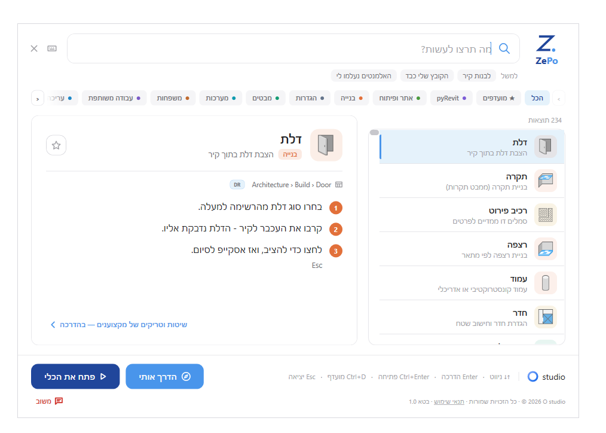

# ZePo — זה פה

**מאתר הכלים בעברית לרוויט**
מאת O studio

  

## יודע מה אתה רוצה לעשות, לא איך זה נקרא

כל אדריכל מכיר את זה: אתה יודע בדיוק מה צריך לעשות במודל, אבל הכלי מתחבא באיזה טאב,
תחת שם באנגלית שאף אחד לא זוכר.

ZePo פותר את זה. כותבים בעברית פשוטה **"לחתוך קיר"**, **"להעתיק לקומה אחרת"**,
**"למה הדלת לא נראית"** — והתוסף מוצא את הכלי הנכון, מציג את האייקון האמיתי מהרצועה,
מסביר איפה הוא נמצא, ומפעיל אותו בלחיצה.

## מה יש בפנים

- **חיפוש בעברית טבעית** — 234 כלים, אלפי מילים נרדפות. לא צריך לדעת את השם באנגלית.
- **האייקון האמיתי** — רואים בדיוק את הסמל שמופיע ברצועה, לא ציור גנרי.
- **הדרכה בשלוש רמות** — מהיר / רגיל / מורחב. בוחרים כמה עומק צריך.
- **הפעלה ישירה** — כפתור אחד והכלי פעיל במודל.
- **פתרון תקלות** — "למה זה לא עובד" מקבל תשובה, לא רק מיקום בתפריט.
- **מועדפים והיסטוריה** — הכלים שאתה משתמש בהם צפים למעלה.

## אופליין לחלוטין

ZePo לא מתחבר לאינטרנט. בכלל.
אפס קריאות רשת, אפס API, אפס טלמטריה. שום מידע לא יוצא מהמחשב שלך —
לא שמות פרויקטים, לא תוכן מודלים, לא מה חיפשת.

זה לא הבטחה שיווקית, זה איך שהתוסף בנוי. הוא עובד מצוין גם במשרד שחוסם אינטרנט לגמרי.

## דרישות

- רוויט **2023 עד 2026**
- ווינדוס
- לא נדרשות הרשאות מנהל

## הורדה והתקנה

הורידו את `ZePo_Setup.exe` מ־**[הגרסה האחרונה](../../releases/latest)**, והריצו.
המתקין מזהה לבד אילו גרסאות רוויט מותקנות אצלכם.

### אם ווינדוס מציג אזהרה

הקובץ עדיין לא חתום דיגיטלית, ולכן ווינדוס עשוי להציג מסך כחול:
**"Windows protected your PC"**.

זה נורמלי לתוכנה חדשה ולא אומר שיש בעיה בקובץ. כדי להמשיך:

1. לוחצים על **More info**
2. לוחצים על **Run anyway**

## משוב

ZePo נמצא כרגע ב**בטא חינמית**, ואתם עוזרים לעצב אותו.

בתוך התוסף יש כפתור **משוב** — לחיצה עליו פותחת חלון קצר לדיווח על תקלה,
כלי שלא נמצא, או הצעה. אפשר גם לפתוח כאן [Issue](../../issues).

חסר לכם כלי? כתבו — הוא ייכנס.

---

© O studio · כל הזכויות שמורות · Autodesk ו-Revit הם סימנים מסחריים של Autodesk, Inc.
ZePo אינו מוצר של Autodesk ואינו קשור אליה.

